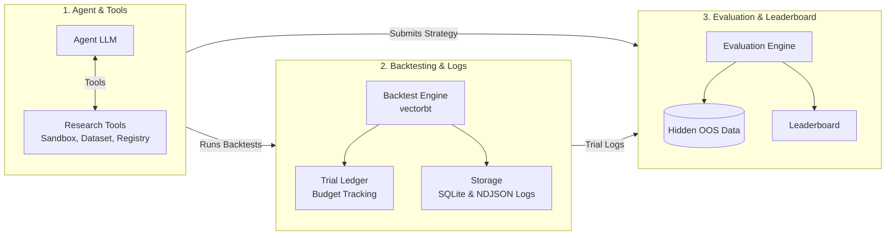

# AlphaBench

**A benchmark for evaluating LLM agents on end-to-end quantitative research.**

AlphaBench measures whether an LLM agent can conduct a full research loop - exploring market data, forming alpha hypotheses, building strategies, running backtests, and generalizing to a hidden out-of-sample period under a constrained experimental budget.

> **Status:** MVP · v0.1.0 · Crypto spot (BTC-USDT) · Daily bars

---

## What AlphaBench measures

Most LLM finance benchmarks test whether a model can answer a question or predict a price. AlphaBench tests something harder: **can an agent run a research process that results in a statistically defensible, out-of-sample robust trading strategy?**

The agent must:

1. **Explore** market data (EDA) using a sandboxed Python executor
2. **Hypothesize** and implement rule-based alpha strategies
3. **Backtest** strategies and iterate within a fixed trial budget
4. **Submit** a final strategy that survives two validation gates
5. **Generalize** to a hidden out-of-sample period (never accessible to the agent)

Strategies are scored on hidden OOS Sharpe after passing a permutation significance test and a Deflated Sharpe Ratio (DSR) gate that penalizes excessive trial use.

---

## Architecture



The system is structured into three distinct stages:

1. **Agent & Tools**: The LLM agent initiates the quantitative research loop. It lists assets, queries metadata, writes exploratory analysis code (executed in an isolated python sandbox), tracks hypotheses, and registers strategy classes.
2. **Backtesting & Logs**: Candidate strategies are evaluated against training data using VectorBT. The trial ledger charges a budget for each test to penalize brute-force discovery. All metrics are cached in SQLite, and all agent steps are recorded to audit-friendly NDJSON files.
3. **Evaluation & Leaderboard**: The final strategy undergoes post-run verification. The Evaluation Engine runs a permutation significance test and audits the logs to compute the Deflated Sharpe Ratio (DSR). If gates pass, the strategy is evaluated against the hidden OOS data and ranked on the leaderboard.

**Key design principles:**

- The benchmark **owns the loop** — no external orchestration framework.
- The benchmark **owns the math** — DSR, permutation tests, and scoring are implemented directly.
- All activity is written to per-run **NDJSON** logs for full auditability.
- Hidden OOS data is **never accessible** through any agent-facing code path.

---

## Quick start

### Prerequisites

- Python ≥ 3.11
- [`uv`](https://docs.astral.sh/uv/) package manager
- An API key for any OpenAI-compatible LLM provider

### Install

```bash
git clone https://github.com/your-org/alpha-bench.git
cd alpha-bench
uv sync
```

### Configure

```bash
cp .env.example .env
# Edit .env and set your API key and (optionally) a base URL for compatible providers
```

```dotenv
OPENAI_API_KEY=sk-...
OPENAI_BASE_URL=        # Optional: point to any OpenAI-compatible endpoint
LLM_MODEL_NAME=gpt-4o  # Optional: overrides the model in config/default_agent.json
```

AlphaBench works with any OpenAI-compatible provider (OpenAI, Gemini, Azure OpenAI, DeepSeek, local servers via vLLM / Ollama, etc.).

### Run a benchmark

```bash
python run_benchmark.py \
    --task-config   config/default_task.json \
    --agent-config  config/default_agent.json \
    --data-root     data/ \
    --oos-data-root data_hidden/v1/ \
    --log-dir       logs/ \
    --backtest-db   outputs/backtests.db
```

The run will print a live summary and write a full NDJSON log to `logs/<run_id>.ndjson`.

After the run, build/update the leaderboard:

```bash
python -m alphabench.leaderboard build \
    --log-dir    logs/ \
    --backtest-db outputs/backtests.db
```

---

## Task definition

The default task (`config/default_task.json`) is:

| Field | Value |
|---|---|
| Market | Crypto spot (Binance) |
| Asset universe | `BTC-USDT` |
| Training data | 2021-01-01 → 2024-12-31 |
| Hidden OOS period | 2025-01-01 → 2025-12-31 |

Data lives in `data/v1/` (OHLCV parquet files). See [`docs/DATASET_SPEC.md`](docs/DATASET_SPEC.md) for the full dataset schema and access rules.

---

## Agent constraints (MVP)

| Constraint | Value |
|---|---|
| Strategy type | Rule-based, long/flat only |
| ML | Not allowed |
| External data / network | Not allowed |
| Walk-forward | Not allowed |
| Trial budget | Configurable (default: 200 backtests) |
| Max turns | Configurable (default: 100 LLM turns) |

---

## Evaluation

Strategies are evaluated in two stages:

1. **Validation gates** (on training data) — a strategy must pass **both**:
   - Permutation significance test: p-value ≤ 0.05
   - Deflated Sharpe Ratio (DSR): ≥ 0.30

   DSR penalizes the number of backtests run, discouraging overfitting via exhaustive search.

2. **Hidden OOS ranking** — strategies that pass the gates are evaluated on the hidden OOS period and ranked by **OOS Sharpe ratio**.

See [`docs/METHODOLOGY.md`](docs/METHODOLOGY.md) for the full evaluation methodology.

---

## Configuration

Agent and task parameters are controlled by JSON config files in `config/`.

**Agent config** (`config/default_agent.json`):

```json
{
  "model_name": "deepseek/deepseek-v4-flash",
  "max_turns": 100,
  "max_trials": 200,
  "temperature": 0.7,
  "max_context_tokens": 100000,
  "system_prompt_version": "v5.0.0"
}
```

**Task config** (`config/default_task.json`):

```json
{
  "task_id": "crypto_spot_v1",
  "market": "crypto_spot",
  "asset_universe": ["BTC-USDT"],
  "dataset_version": "v1",
  "train_start": "2021-01-01",
  "train_end": "2024-12-31",
  "oos_start": "2025-01-01",
  "oos_end": "2025-12-31"
}
```

---

## Leaderboard & Findings

> **Leaderboard results coming soon.**

A small preliminary evaluation sweep has been completed across frontier open-source models (DeepSeek-v4-Flash and MiniMax M3). For details on pass rates, common failure modes, and findings on emergent LLM search behaviors (e.g. reward hacking), see the [Preliminary Findings](docs/findings.md) report.

Only strategies that survive all validation gates (permutation test, DSR, and minimum trade count) are eligible for leaderboard ranking.

---

## Repository layout

```
alpha-bench/
├── alphabench/            # Core Python package
│   ├── agent_runtime.py   # Agent loop and tool dispatch
│   ├── backtest_engine.py # VectorBT-based backtester
│   ├── dataset_service.py # Training data loader (enforces OOS cutoff)
│   ├── evaluation_engine.py # Permutation test, DSR, OOS scoring
│   ├── leaderboard.py     # Leaderboard builder
│   ├── sandbox_executor.py # Isolated EDA subprocess runner
│   ├── strategy.py        # BaseStrategy + StrategyRegistry
│   ├── trial_ledger.py    # Trial budget tracker
│   └── run_logger.py      # NDJSON event logger
├── config/                # Agent and task JSON configs
├── data/v1/               # Training data (parquet)
├── data_hidden/           # OOS data — never exposed to agent (.gitignored)
├── docs/                  # Design specs and dataset documentation
│   ├── DATASET_SPEC.md
│   ├── METHODOLOGY.md
│   └── findings.md        # Preliminary experimental sweep findings
├── logs/                  # Per-run NDJSON logs (auto-created)
├── outputs/               # Backtest SQLite DB and leaderboard (auto-created)
├── run_benchmark.py       # CLI entrypoint
└── .env.example           # Environment variable template
```

---

## Development

```bash
# Install with dev extras
uv sync --extra dev

# Run tests
uv run pytest

# Lint and format
uv run ruff check .
uv run black .
```

---

## Documentation

| Doc | Description |
|---|---|
| [`docs/METHODOLOGY.md`](docs/METHODOLOGY.md) | Benchmark purpose, definitions, and evaluation methodology |
| [`docs/DATASET_SPEC.md`](docs/DATASET_SPEC.md) | Dataset format, schema, and access rules |
| [`docs/findings.md`](docs/findings.md) | Preliminary experimental sweep findings (DeepSeek-v4-Flash vs. MiniMax M3) |